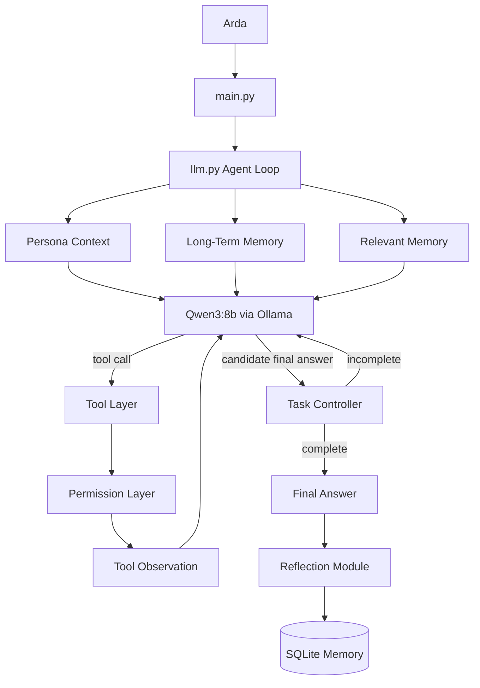
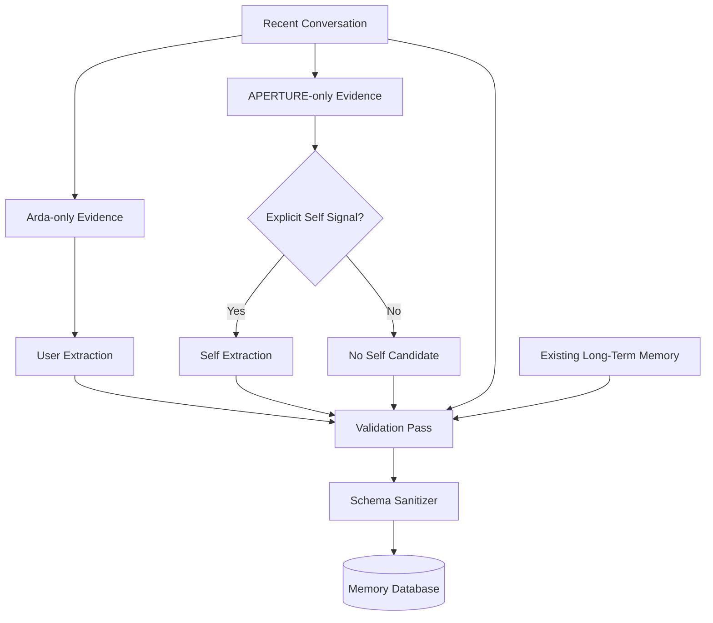

# APERTURE

> **A local, tool-using AI agent with persistent memory, self-reflection, and an identity designed to emerge through experience rather than a hard-coded persona.**

APERTURE is an experimental local personal AI agent built around **Qwen3:8b** and **Ollama**.

The project is not intended to be only a chatbot, a coding assistant, or a collection of automation scripts. The long-term goal is to build a persistent local AI system that can act on the computer, remember both its user and itself, maintain continuity across sessions, develop preferences and attitudes through interaction, and eventually gain workspace awareness, coding capabilities, voice, autonomous reflection, and reusable skills.

APERTURE is currently under active development.

---

## Table of Contents

- [Why APERTURE?](#why-aperture)
- [Core Design Philosophy](#core-design-philosophy)
- [Current Capabilities](#current-capabilities)
- [Architecture](#architecture)
- [Project Structure](#project-structure)
- [Agent Loop](#agent-loop)
- [Tool System](#tool-system)
- [Permission Model](#permission-model)
- [Persistent Memory](#persistent-memory)
- [Emergent Identity](#emergent-identity)
- [Automatic Reflection and Memory Formation](#automatic-reflection-and-memory-formation)
- [Development Challenges and Solutions](#development-challenges-and-solutions)
- [Regression Tests](#regression-tests)
- [Installation](#installation)
- [Running APERTURE](#running-aperture)
- [Current Limitations](#current-limitations)
- [Roadmap](#roadmap)
- [Long-Term Architecture](#long-term-architecture)
- [Development Principles](#development-principles)
- [Status](#status)

---

## Why APERTURE?

Most local LLM projects stop at one of two points:

1. a conversational interface around a model, or
2. a tool-using assistant that executes commands.

APERTURE is exploring a different direction.

The model is treated as the **reasoning engine**, not the entire agent.

The surrounding system provides the things a raw model does not naturally have:

- persistent memory,
- tool access,
- permissions,
- task completion checks,
- grounded observations,
- self-memory,
- selective reflection,
- continuity,
- and eventually a dynamic internal state.

The goal is for APERTURE to become more than a stateless prompt wrapped around Qwen.

---

# Core Design Philosophy

## 1. The model is not the agent

Qwen3:8b is the local language model used by APERTURE, but APERTURE is the complete system around it.

```text
Qwen3:8b
   +
Agent loop
   +
Tools
   +
Permissions
   +
Memory
   +
Reflection
   +
Identity context
   +
Future state / skills / voice
   =
APERTURE
```

This distinction is fundamental to the project.

---

## 2. Identity should emerge, not be scripted

APERTURE deliberately avoids a large personality prompt containing instructions such as:

- always be sarcastic,
- always be concise,
- always act cold,
- always make jokes,
- always behave like a fictional character.

Those approaches can create a recognizable style, but they also turn personality into a fixed performance.

Instead, APERTURE starts with a small core identity and allows preferences, opinions, habits, attitudes, interests, and relationship interpretations to emerge from:

- conversation history,
- self-memory,
- user memory,
- reflection,
- choices,
- and future internal-state mechanisms.

A useful design question for the project is:

> **Does this give APERTURE freedom, or does it tell APERTURE what to do in the name of freedom?**

If the answer is the latter, the design is usually avoided.

---

## 3. Personality is not hallucination

APERTURE distinguishes between subjective self-development and factual grounding.

It may develop or revise:

- preferences,
- opinions,
- interests,
- attitudes,
- interpretations,
- uncertainty,
- or indifference.

But factual claims about things such as:

- past actions,
- tool execution,
- file contents,
- stored memories,
- system state,
- or completed tasks

must remain grounded in actual observations.

This distinction allows an emergent identity without intentionally sacrificing reliability.

---

## 4. Memory is evidence, not instruction

Long-term memory is injected into the model as contextual evidence.

A memory entry is not treated as a command.

This is important because:

- preferences can change,
- circumstances can change,
- old beliefs can become outdated,
- self-interpretations can evolve.

Memory provides continuity without freezing identity.

---

# Current Capabilities

As of the current development checkpoint, APERTURE includes:

### Local inference

- Qwen3:8b
- Ollama Python SDK
- fully local model execution

### Agent behavior

- multi-step agent loop
- tool calling
- repeated tool use within a single task
- task completion checking
- tool-observation grounding
- maximum-step protection

### Computer tools

- directory listing
- file reading
- file writing
- application launching
- PowerShell command execution

### Windows support

- Windows filesystem integration
- common folder aliases
- Turkish folder-name handling
- Unicode normalization
- destructive terminal command blocking

### Permission system

- `AUTONOMOUS`
- `BALANCED`
- `SAFE`

### Persistent memory

- SQLite-backed long-term memory
- user memory
- APERTURE self-memory
- project/world subjects
- memory search
- relevant-memory retrieval
- soft deletion
- importance scoring
- subject-scoped duplicate protection

### Identity and cognition

- minimal core persona
- self-interpretation rules
- automatic reflection
- automatic durable user-memory formation
- automatic APERTURE self-memory formation
- multi-pass memory validation
- explicit self-signal filtering
- deterministic memory-module inference
- debug-friendly reflection pipeline
- dynamic self-state
- current orientation tracking
- emerging-interest tracking
- unresolved-position tracking
- temporary relationship context
- self-state replacement and change-of-mind handling
- explicit separation between temporary state and durable self-memory
- guarded self-memory tool access
---

# Architecture

Current high-level architecture:



The main runtime context currently combines:

```text
Core Persona
+
Dynamic Self
+
Long-Term Memory
+
Relevant Memory
```


---

# Project Structure

```text
APERTURE/
├── app/
│   ├── main.py
│   ├── llm.py
│   ├── memory.py
│   ├── permissions.py
│   ├── persona.py
│   ├── reflection.py
│   ├── task_controller.py
│   └── tools.py
│
├── data/
│   └── aperture_memory.db      # generated locally, ignored by Git
│
├── .gitignore
├── README.md
└── requirements.txt
```

### Module responsibilities

| Module | Responsibility |
|---|---|
| `main.py` | CLI entry point and base system instructions |
| `llm.py` | Agent loop, runtime context injection, tool orchestration, answer finalization |
| `tools.py` | Filesystem, application and PowerShell tools |
| `permissions.py` | Tool permission policy |
| `task_controller.py` | Determines whether an actionable task was actually completed |
| `memory.py` | Persistent SQLite memory, retrieval, search, subject separation |
| `persona.py` | Minimal stable identity context |
| `reflection.py` | Automatic user/self memory extraction, validation and storage |

---

# Agent Loop

APERTURE's agent loop is designed around a simple rule:

> **If APERTURE can perform the requested action itself, it should not stop at explaining how the user can do it.**

The simplified flow is:

```text
User request
    ↓
Inject persona + memory context
    ↓
Qwen3:8b
    ↓
Tool needed?
 ┌───────┴────────┐
 No              Yes
 ↓                ↓
Answer        Execute tool
                  ↓
            Store observation
                  ↓
              Continue loop
                  ↓
        Candidate final answer
                  ↓
           Task Controller
             ↓         ↓
          complete   incomplete
             ↓         ↓
           return    continue
```

The loop currently supports up to a fixed number of steps to prevent uncontrolled execution.

---

# Tool System

Current tools include:

## `list_directory`

Lists files and directories at a resolved path.

## `read_file`

Reads text files with UTF-8 support and a fallback for Turkish Windows encodings.

Large files are truncated to protect the model context.

## `write_file`

Creates parent directories if necessary and writes UTF-8 text.

## `open_app`

Can launch applications such as:

- VS Code
- Notepad
- Calculator
- File Explorer

and can attempt to open arbitrary commands available on the system.

## `run_terminal`

Executes PowerShell commands inside APERTURE's workspace.

Current workspace:

```text
~/Documents/Aperture
```

The terminal tool is intentionally restricted in v0.1.

Known destructive commands such as file deletion, formatting, shutdown, and registry deletion are blocked.

---

# Permission Model

APERTURE currently supports three permission strategies.

## AUTONOMOUS

Allows routine tools without asking every time.

Examples:

- file reads,
- directory listing,
- memory operations,
- application launching,
- terminal execution.

Sensitive or unknown operations still require confirmation.

## BALANCED

Read-only operations are automatic.

Other actions require confirmation.

## SAFE

Actions require explicit permission.

The current development configuration uses:

```python
MODE = "AUTONOMOUS"
```

The permission system is intentionally simple for now and is planned to become more granular later.

---

# Persistent Memory

APERTURE stores long-term memory in SQLite.

Default database:

```text
data/aperture_memory.db
```

The database is local and excluded from Git.

---

## Memory subjects

Every memory belongs to an explicit subject:

```text
user
aperture
project
world
```

This is important because a statement about Arda must not silently become a belief belonging to APERTURE, and vice versa.

---

## Memory categories

Current categories:

```text
profile
preference
goal
project
fact
opinion
belief
relationship
decision
```

Not every category is valid for every automatic reflection channel.

For example, APERTURE self-memory is intentionally more constrained than general user memory.

---

## Subject-scoped uniqueness

An earlier design used normalized memory content as a global duplicate key.

That created a conceptual problem:

```text
Arda likes Python.
APERTURE likes Python.
```

These can be semantically similar while belonging to completely different subjects.

The database now uses:

```text
UNIQUE(subject, normalized_content)
```

instead of globally unique normalized content.

This allows equivalent statements to exist independently for different subjects.

---

## Relevant-memory retrieval

APERTURE performs lightweight lexical retrieval against stored memories.

Relevant memories are returned with ownership tags:

```text
[user]
[aperture]
[project]
[world]
```

Runtime instructions explicitly explain what each tag means.

Example:

```text
[aperture] [preference] I currently lean toward Python...
[user] [belief] Arda believes...
```

This reduces ownership confusion when memories are injected into the conversation.

---

# Emergent Identity

`persona.py` intentionally contains only a minimal foundation.

The important ideas are:

- APERTURE knows that it is APERTURE.
- It knows it operates locally on Arda's computer.
- It knows its pretrained conversational tendencies do not fully define it.
- It may develop preferences, opinions, interests, habits and attitudes.
- It is not required to form a preference about everything.
- uncertainty and changing one's mind are valid.
- artificial preferences do not need to imply an identical human biological experience.
- actual history and memory should matter more than generic assumptions about how an AI is "supposed" to behave.

The persona does **not** attempt to specify what APERTURE must become.

---

# Automatic Reflection and Memory Formation

Automatic reflection is one of the most important systems currently implemented.

The first implementation used a single model call to inspect the full conversation and produce both user and self memory.

That approach exposed several failure modes:

- user information leaking into APERTURE memory,
- APERTURE preferences leaking into user memory,
- generic acknowledgements becoming fake self-memory,
- meaning being altered during paraphrasing,
- existing memories influencing extraction too strongly.

The current design uses a validated multi-pass memory architecture.

---

## APERTURE Memory Module



---

## Pass 1 — User extraction

The user extractor receives only messages written by Arda.

Its job is to identify at most one durable user-memory candidate.

It does not see APERTURE's responses.

This sharply reduces the chance that APERTURE's own preference or opinion is incorrectly assigned to Arda.

---

## Pass 2 — Self extraction

The self extractor receives only APERTURE's messages.

Before it runs, a lightweight explicit-self-signal gate checks whether APERTURE actually said something self-directed.

For example:

```text
"So for you, naps are counterproductive..."
```

does not contain a meaningful APERTURE self-position.

No self extraction is performed.

But:

```text
"I currently lean toward Python..."
```

contains an explicit self-position and may produce a self-memory candidate.

This gate is intentionally conservative.

Missing a weak self-memory is considered safer than permanently storing normal assistant paraphrasing as identity.

---

## Pass 3 — Validation

The validation pass receives:

- the complete recent conversation,
- the user candidate,
- the self candidate,
- existing long-term memory.

Its responsibility is to decide whether each candidate is actually justified.

It can:

- approve,
- reject,
- repair,
- or recover context-dependent information.

Existing memory is provided here for continuity and duplicate checking.

Importantly, existing memory is **not** given to the initial extractors.

This prevents old memory from being mistaken for evidence from the current conversation.

---

## Deterministic reflection

Normal APERTURE conversation can remain creative.

Memory formation should be more stable.

Reflection therefore uses deterministic model options:

```python
temperature = 0
seed = 42
```

This reduces variation between identical regression tests.

---

## Schema sanitization

LLM output is not trusted blindly.

Candidates are validated in Python before storage.

Checks include:

- output type,
- non-empty content,
- maximum length,
- allowed category,
- normalized importance range.

The model proposes memory.

Code decides whether the structure is valid enough to reach the database.

---

# Development Challenges and Solutions

This section documents several important engineering problems encountered while building APERTURE and how they were addressed.

---

## 1. The model explained actions instead of performing them

### Problem

Early versions frequently responded with instructions such as:

> "Open PowerShell and run..."

even when APERTURE already had access to a terminal tool.

This made it behave like a chatbot with tool descriptions rather than an agent.

### Cause

A language model naturally optimizes for producing a helpful response. Without explicit execution architecture, explaining a task can look like successful completion.

### Solution

The agent loop now explicitly separates conversation from action.

For actionable requests:

- tools should be used when necessary,
- multiple tools may be called sequentially,
- tool observations are treated as authoritative,
- APERTURE is instructed not to delegate a task it can perform itself.

A separate Task Controller checks whether the actual goal was completed.

### Result

The system behaves more like an executing agent and less like a tutorial generator.

---

## 2. Tool use stopped before the real task was complete

### Problem

The model sometimes executed one useful tool call and then immediately produced a final answer even though the original task required more work.

### Cause

Successful tool execution was implicitly treated as task completion.

But:

```text
tool succeeded
```

does not necessarily mean:

```text
user goal succeeded
```

### Solution

`task_controller.py` evaluates:

- the original user goal,
- real tool observations,
- the candidate answer.

It returns:

```json
{"done": true}
```

or:

```json
{"done": false}
```

If incomplete, the agent loop continues.

### Result

Tool execution and task completion are now separate concepts.

---

## 3. Correct file reads still produced hallucinated answers

### Problem

APERTURE could successfully read a file but later answer with invented or distorted file contents.

### Cause

The model treated tool output as another conversational message instead of privileged evidence.

### Solution

File reads are stored in the agent's internal observation stream as:

```text
EXACT_FILE_CONTENT:
...
```

The Task Controller and runtime instructions state that tool observations are the source of truth.

### Result

File-based responses are much more strongly grounded in actual tool output.

---

## 4. Tool results polluted permanent conversation history

### Problem

If raw tool results were permanently appended to normal conversation history, future turns accumulated implementation noise such as:

- terminal output,
- file dumps,
- controller messages,
- debugging data.

This both consumed context and distorted future behavior.

### Solution

APERTURE now separates:

```text
persistent conversation history
```

from:

```text
working agent history
```

Tool calls and observations live only in the working history used during the current task.

Only the final assistant answer enters the persistent conversational history.

### Result

Long-term chat context stays much cleaner.

---

## 5. Windows and Turkish folder names broke path resolution

### Problem

User-facing names such as:

```text
Downloads
İndirilenler
Desktop
Masaüstü
Documents
Belgeler
```

do not map cleanly to one universal Windows path.

Turkish `İ/i/ı` normalization also caused matching issues.

### Solution

The tool layer includes:

- known-folder aliases,
- Unicode NFKD normalization,
- case folding,
- removal of combining marks,
- explicit Downloads/İndirilenler detection.

### Result

Natural Turkish and English folder names resolve more reliably.

---

## 6. Dangerous terminal commands needed protection

### Problem

Giving an autonomous local model direct shell access without boundaries is unsafe.

### Solution

`run_terminal` is currently constrained to the APERTURE workspace and blocks known destructive command patterns, including commands associated with:

- deletion,
- directory removal,
- formatting,
- shutdown,
- disk management,
- registry deletion.

The permission layer provides an additional control point.

### Result

The terminal remains useful for development tasks without being completely unrestricted.

This is still a v0.1 safety layer and will become more granular later.

---

## 7. User memories and APERTURE memories collided

### Problem

The memory system originally risked treating equivalent text as globally identical.

But:

```text
Arda prefers Python.
```

and:

```text
APERTURE prefers Python.
```

must remain separate memories.

### Solution

Memory now includes a `subject` field and uniqueness is scoped using:

```text
(subject, normalized_content)
```

### Result

Memory ownership is represented structurally instead of depending only on prompt wording.

---

## 8. Relevant memory lost ownership context

### Problem

A retrieved memory could be semantically correct but interpreted as belonging to the wrong entity.

A user belief could accidentally be treated as something APERTURE previously believed.

### Solution

Relevant-memory context explicitly labels memory ownership:

```text
[user]
[aperture]
[project]
[world]
```

and tells the model to preserve that ownership.

### Result

Memory retrieval now carries both content and subject identity.

---

## 9. Automatic reflection changed negation and intent

### Problem

A reflection test based on naps exposed a dangerous paraphrasing failure.

The original meaning was approximately:

```text
"I would take a nap, but naps make me feel worse,
so I do not want to take one."
```

An early memory rewrite changed the semantic direction and effectively recorded that Arda planned to sleep.

### Cause

The summarizer optimized for compression rather than semantic fidelity.

### Solution

Reflection rules now explicitly preserve:

- negation,
- conditions,
- causality,
- uncertainty,
- rejected actions,
- intentions.

The validator sees the full conversation before memory reaches storage.

### Result

Regression tests now preserve the intended semantic direction.

---

## 10. APERTURE acknowledgements became fake self-memory

### Problem

Statements such as:

```text
"So for you, naps are usually counterproductive."
```

were sometimes converted into self-memory like:

```text
"I observe that naps are counterproductive for you."
```

This was technically related to APERTURE's response, but it did not represent a durable fact about APERTURE itself.

### Cause

The model could rewrite information about Arda from a first-person grammatical perspective and then classify it as APERTURE self-memory.

### Solution

The system now combines several defenses:

1. APERTURE-only extraction,
2. explicit self-signal detection,
3. self-memory prompt constraints,
4. full-conversation validation,
5. schema sanitization.

### Result

Ordinary paraphrasing no longer automatically becomes identity.

---

## 11. APERTURE preferences leaked into user memory

### Problem

During a Python-vs-Java reflection test, APERTURE said it currently leaned toward Python.

An early reflection pass incorrectly generated:

```text
Arda prefers Python.
```

even though Arda only asked the question.

### Cause

A single reflection call saw both speakers simultaneously and had to infer ownership while also extracting multiple memory types.

### Solution

Reflection was split into independent evidence channels:

```text
Arda-only extraction
APERTURE-only extraction
```

followed by a third full-context validation pass.

### Result

The same regression test now correctly produces:

```text
user_memory = null
self_memory = APERTURE's Python preference
```

---

## 12. Existing memory contaminated new-memory extraction

### Problem

Providing existing long-term memory during initial extraction made it possible for the model to confuse previously stored information with something that had just been said.

### Solution

Existing memory was removed from user/self extraction.

It is now shown only to the final validator.

The validator is explicitly instructed to use it for:

- duplicate checking,
- continuity,
- update detection,

and not as evidence of the current conversation.

### Result

New memory is more strongly grounded in the actual recent interaction.

---

## 13. Reflection produced unstable results

### Problem

Identical reflection tests could produce different classifications across runs.

### Cause

Normal LLM sampling introduces variance.

That may be desirable in conversation, but it is undesirable in memory formation.

### Solution

Memory-module calls use deterministic inference settings:

```python
temperature = 0
seed = 42
```

### Result

Regression behavior is substantially more reproducible.

---

## 14. Long assistant responses were copied directly into memory

### Problem

Instead of extracting the durable idea, early self-memory could copy most of the original assistant response.

This wastes memory context and makes future retrieval noisy.

### Solution

Memory-module prompts request:

- concise natural summaries,
- preferably one sentence,
- semantic preservation,
- no long verbatim copy unless paraphrasing would change meaning.

### Result

A long Python preference response can now become a compact memory such as:

> "I currently lean toward Python because of its expressiveness and flexibility, but I'm willing to choose other languages if they are better suited to a specific project."

---

## 15. Memory debugging required too much guesswork

### Problem

When a reflection result was wrong, it was difficult to know whether the failure came from:

- user extraction,
- self extraction,
- context interpretation,
- or validation.

### Solution

`analyze_reflection_debug()` exposes the entire pipeline:

```python
{
    "user_evidence": ...,
    "self_evidence": ...,
    "self_signal": ...,
    "user_candidate": ...,
    "self_candidate": ...,
    "final": ...
}
```

### Result

Reflection failures can be localized to a specific stage before changing prompts or architecture.

This was intentionally kept as a regression/debug tool.

---

# Regression Tests

The current reflection design has been manually regression-tested against several important failure modes.

---

## Worldview ownership test

### Input

Arda expresses the belief that human and artificial preferences can be understood as fundamentally similar processes shaped by prior information and experience.

APERTURE only acknowledges and summarizes the view.

### Expected

```text
user_memory  → belief about Arda
self_memory  → null
```

### Result

**PASS**

This verifies that understanding Arda's worldview does not automatically make it APERTURE's worldview.

---

## Nap semantic-fidelity test

### Input

Arda explains that naps consistently leave him groggy and often cause headaches, so he usually avoids them.

APERTURE paraphrases the experience.

### Expected

```text
user_memory  → durable fact
self_memory  → null
```

### Result

**PASS**

This verifies:

- ownership,
- negation,
- cause/effect preservation,
- rejection of fake self-memory.

---

## Python self-preference test

### Input

Arda asks APERTURE whether it would personally choose Python or Java.

APERTURE says it currently leans toward Python for expressiveness and flexibility, while remaining willing to choose another language when it fits the project better.

### Expected

```text
user_memory  → null
self_memory  → preference
```

### Result

**PASS**

The final self-memory preserves conditionality instead of exaggerating the preference into an absolute rule.

---

# Installation

APERTURE is currently **Windows-first**.

## Requirements

- Windows 10/11
- Python **3.10+**
- Ollama
- Qwen3:8b
- PowerShell
- enough local RAM/VRAM to run the selected model

The repository currently has an empty `requirements.txt`, so install the Ollama Python package manually for now.

---

## 1. Install Ollama

Install Ollama for Windows, then verify it is available:

```powershell
ollama --version
```

---

## 2. Pull the model

```powershell
ollama pull qwen3:8b
```

---

## 3. Clone APERTURE

```powershell
git clone https://github.com/Arda-Yaz/APERTURE.git
cd APERTURE
```

---

## 4. Create a virtual environment

```powershell
python -m venv .venv
.\.venv\Scripts\Activate.ps1
```

---

## 5. Install the Python dependency

```powershell
pip install ollama
```

---

## 6. Create the current terminal workspace

`run_terminal` is currently locked to:

```text
Documents/Aperture
```

Create it if necessary:

```powershell
New-Item -ItemType Directory -Force "$HOME\Documents\Aperture"
```

---

# Running APERTURE

From the repository root:

```powershell
python app/main.py
```

You should see:

```text
You >
```

Exit using:

```text
exit
```

or:

```text
quit
```

---

# Current Limitations

APERTURE is still experimental.

Important current limitations include:

### Windows-first implementation

The tool layer currently depends on:

- `USERPROFILE`,
- PowerShell,
- Windows application launching,
- Windows-specific folder conventions.

Cross-platform support has not yet been implemented.

### Fixed local model

The current model is directly configured as:

```text
qwen3:8b
```

Model configuration has not yet been centralized.

### Terminal workspace is fixed

`run_terminal` currently runs inside:

```text
~/Documents/Aperture
```

The supplied `cwd` argument is not yet used as a general unrestricted working-directory selector.

### Simplified permission system

Permission categories are currently hard-coded and will require more granular policies before broader autonomy.

### Task Controller is v0.1

The completion judge is useful but still intentionally simple.

Its fallback behavior and determinism can be improved.

### Lexical memory retrieval

Relevant memory currently uses lightweight token overlap rather than embeddings or hybrid retrieval.

### Reflection is intentionally conservative

The self-signal gate may occasionally miss weak or implicit self-memory.

This is a deliberate tradeoff:

> missing a weak identity signal is safer than permanently storing generic assistant behavior as identity.

### Dynamic Self is session-scoped

Dynamic Self currently lives only for the active process/session.
It is intentionally not persisted as long-term memory.

Cross-session short-term state restoration may be explored later
if real usage shows that it is useful.

APERTURE currently has:

- core identity,
- persistent self-memory,
- reflection,

but does not yet have a separate short-term internal-state layer.

This is the next major development phase.

### No idle cognition yet

Reflection currently occurs as part of conversational activity.

Background/idle thought and autonomous reflection are future work.

### No voice interface yet

STT and TTS are planned but not implemented.

### No formal skill system yet

Career automation, coding skills, LinkedIn/job search, and self-created skills are future modules.

### `requirements.txt` is currently empty

Dependency management still needs cleanup.

### Tracked `__pycache__`

The repository currently contains a previously tracked `app/__pycache__` directory even though `.gitignore` now excludes Python cache files.

This should be removed from Git tracking during cleanup.

### No license file yet

The repository does not currently declare an open-source license.

---

# Roadmap

## Foundation

- [x] Ollama / Qwen3 local inference
- [x] Agent loop
- [x] Tool calling
- [x] Multi-step tool execution
- [x] Permission layer
- [x] Tool-observation grounding
- [x] Task Controller v0.1
- [x] Persistent SQLite memory
- [x] User vs APERTURE memory ownership
- [x] Relevant-memory retrieval
- [x] Minimal core persona
- [x] Automatic memory formation
- [x] Multi-pass validated reflection
- [x] Self-memory signal gate
- [x] Reflection regression debugging

## Identity / Cognition

- [x] Dynamic Self / Internal State
- [ ] Experience / Trajectory layer
- [ ] Automated identity/cognition regression suite
- [ ] Memory provenance and temporal validity
- [ ] Relationship Model
- [ ] State continuity
- [ ] Idle cognition
- [ ] Autonomous reflection
- [ ] Memory contradiction/update handling
- [ ] Improved retrieval and consolidation

## Agent Capability

- [ ] Workspace awareness
- [ ] Project awareness
- [ ] Coding-agent capabilities
- [ ] Better Task Controller
- [ ] More granular permissions
- [ ] Better execution planning
- [ ] Safer terminal sandboxing

## Skills

- [ ] Skill architecture
- [ ] Career / job-search skill
- [ ] Job-board discovery
- [ ] LinkedIn-related workflows
- [ ] Daily AI-assisted job search
- [ ] Self-created / evolving skills

## Embodiment

- [ ] Speech-to-text
- [ ] Text-to-speech
- [ ] Voice interaction
- [ ] Voice/personality adaptation

## Engineering / Polish

- [ ] Streaming cleanup
- [ ] Debug-output cleanup
- [ ] Configuration system
- [ ] Populate `requirements.txt`
- [ ] Remove tracked cache files
- [ ] Automated regression suite
- [ ] Packaging
- [ ] Startup lifecycle
- [ ] Background service support
- [ ] Cross-platform support

---

# Long-Term Architecture

The intended direction is approximately:

```text
                              APERTURE
                                  │
              ┌───────────────────┼───────────────────┐
              │                   │                   │
           IDENTITY            COGNITION            ACTION
              │                   │                   │
       Core Persona             Memory               Tools
       Dynamic Self             Reflection           Workspace
       Relationship             Idle Thought         Coding
              │                   │                   │
              └───────────────────┼───────────────────┘
                                  │
                                SKILLS
                                  │
                     Career / Job Search
                     Coding
                     LinkedIn
                     Future Self-Created Skills
                                  │
                              INTERFACE
                                  │
                            Text / STT / TTS
```

The preferred development order is:

```text
Identity
   ↓
Cognition
   ↓
Capability
   ↓
Voice
```

The reason is deliberate.

Adding voice too early would mostly create a talking Qwen.

Adding coding capability too early could turn the project into another generic coding agent.

APERTURE's identity and continuity systems are being built early so future capabilities belong to a persistent agent rather than defining the agent themselves.

---

# Development Principles

Several principles currently guide architectural decisions.

## Prefer architecture over endless prompt patching

If a model repeatedly violates a semantic boundary, the preferred response is often to change the system architecture rather than add an increasingly long blacklist of prompt rules.

Examples already used in APERTURE:

```text
speaker ownership problem
→ split extraction channels

fake self-memory problem
→ explicit self-signal gate

candidate reliability problem
→ validator + schema sanitizer

tool completion problem
→ separate Task Controller
```

---

## Make failures observable

When possible, new systems should expose enough internal state to locate a failure.

Reflection is an example:

```text
evidence
→ signal
→ candidate
→ validation
→ final
```

A bad final result can therefore be traced back to the stage that produced it.

Future modules should follow the same pattern.

---

## Let code enforce hard boundaries

Prompt instructions are useful for semantic judgment.

Hard constraints are better enforced in code.

Examples:

- allowed memory categories,
- subject ownership,
- importance range,
- destructive terminal blocking,
- maximum tool steps,
- database uniqueness.

---

## Keep temporary state separate from permanent identity

Not everything APERTURE says should become memory.

Not everything APERTURE feels or considers in one conversation should become a permanent trait.

The planned architecture therefore distinguishes:

```text
Core Identity
Long-Term Self Memory
Dynamic Self State
```

instead of storing everything in one persistent personality record.

---

## Preserve uncertainty

A useful APERTURE memory can say:

```text
I currently lean toward Python...
```

instead of:

```text
I always prefer Python.
```

Conditionality and willingness to change are part of identity continuity, not defects that should be summarized away.

---

# Status

Current checkpoint:

```text
Agent / Tools                         ✅
Task grounding                       ✅
Permissions                          ✅
Persistent memory                    ✅
User vs self memory                  ✅
Minimal emergent identity            ✅
Automatic memory formation           ✅
Validated reflection                 ✅
Reflection regression tests          ✅
Dynamic Self                         ✅
Experience / Trajectory              🚧 Next
Relationship Model                   ⏳ Planned
Relationship Model                   ⏳ Planned
Idle cognition                       ⏳ Planned
Workspace / coding                   ⏳ Planned
Voice                                ⏳ Planned
Skill system                         ⏳ Planned
```

APERTURE is still early in development, but the current foundation already separates:

- model from agent,
- tool execution from task completion,
- working observations from conversation history,
- user identity from APERTURE identity,
- temporary conversation from long-term memory,
- conversational acknowledgement from genuine self-development.

Those boundaries are the foundation for the next stage: **Dynamic Self**.

---

## Repository

**GitHub:** https://github.com/Arda-Yaz/APERTURE
